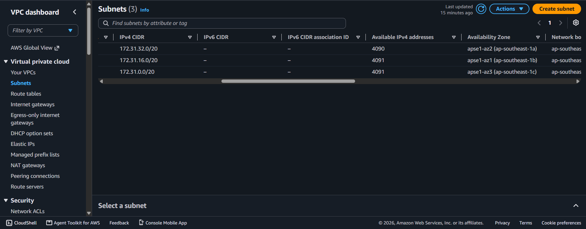
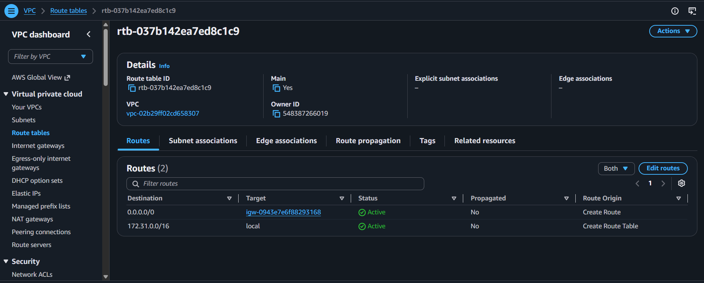
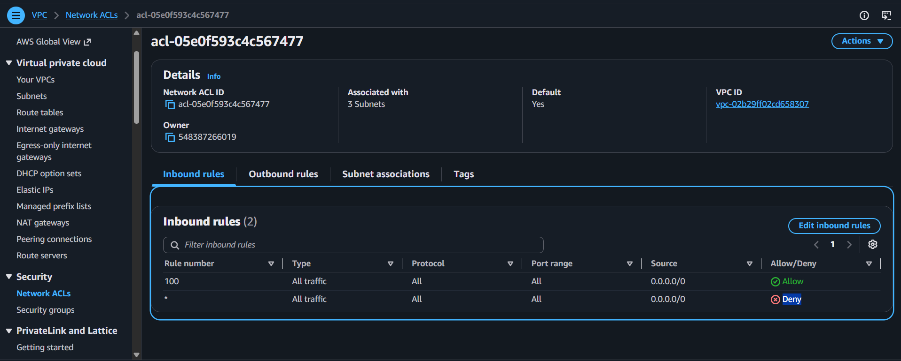
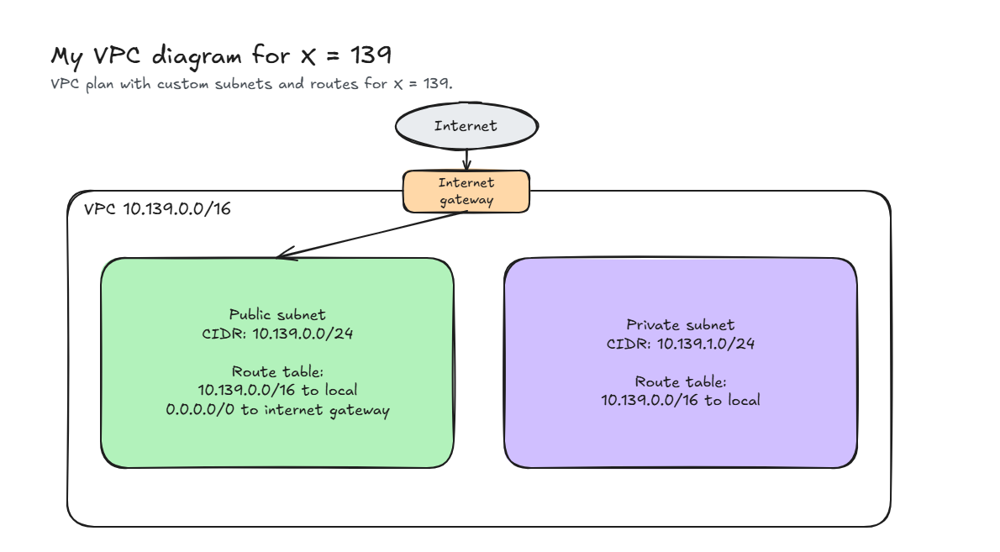

# Assignment 2 Submission

<!--
How to use this template:

1. Copy this file to submissions/assignment-2/<your-github-username>/submission.md
2. Replace every answer placeholder with your own answer. Delete the angle brackets too.
3. Save your four images in the same folder, with the exact file names below.
4. Do not write your full name or your student number in this file.
-->

## About me

- GitHub username: Steeshesh
- Section: 4 ACSAD
- IAM user name that I signed in with: acsad-g04
- X: 139

---

## Part A. Explore

### A1. The VPC

Default VPC IPv4 CIDR:

`172.31.0.0/16`

Number of addresses in that CIDR:

65,536

### A2. The subnets

| Availability Zone | IPv4 CIDR |
| --- | --- |
| `ap-southeast-1a` | `172.31.32.0/20` |
| `ap-southeast-1b` | `172.31.16.0/20` |
| `ap-southeast-1c` | `172.31.0.0/20` |

Screenshot 1. Save it as `screenshot-1-subnets.png` in your folder. The image line below shows it.

### A3. Available addresses

Available IPv4 addresses in each subnet:

`ap-southeast-1a`: 4,090, `ap-southeast-1b`: 4,091, `ap-southeast-1c`: 4,091

Why is the number lower than 4,096?

A `/20` subnet has 4,096 addresses. AWS reserves 5 IP addresses in every subnet (the network address, VPC router, DNS, future use, and broadcast). Therefore, a completely empty subnet has 4,096 − 5 = 4,091 available addresses.

What uses the missing address in the subnet with the lowest number?

`ap-southeast-1a` has 4,090 available addresses (1 less than 4,091). The missing address is in use by an active Elastic Network Interface (ENI), such as a running EC2 instance.

### A4. The route table

| Destination | Target |
| --- | --- |
| `172.31.0.0/16` | `local` |
| `0.0.0.0/0` | `igw-0943e7e6f88293168` |

Screenshot 2. Save it as `screenshot-2-routes.png` in your folder. The image line below shows it.

### A5. Public or private

Are the default subnets public or private? Which route proves it?

Public. The route `0.0.0.0/0` sending traffic to the internet gateway (`igw-0943e7e6f88293168`) proves that the subnets have direct routing to the internet.

### A6. The internet gateway

State of the internet gateway:

Attached

What happens to the default subnets if the gateway is detached?

The route `0.0.0.0/0` loses its target and the subnets lose their connection to the internet. Instances can no longer reach or be reached from the internet, but they can still communicate with each other locally via the `local` route.

### A7. NAT gateways

Number of NAT gateways:

0

Can a server in a new private subnet download updates? Why?

No. A private subnet does not have a route to an internet gateway, and without a NAT gateway deployed in a public subnet, there is no way for instances in the private subnet to route outbound requests to the internet.

### A8. The network ACL

| Rule number | Source | Allow or Deny |
| --- | --- | --- |
| 100 | `0.0.0.0/0` | Allow |
| `*` | `0.0.0.0/0` | Deny |

How is a network ACL different from a security group?

A network ACL operates at the subnet boundary as a stateless firewall (evaluating numbered rules in order and requiring explicit return rules for traffic in both directions). A security group operates at the instance/ENI level as a stateful firewall (evaluating rules to permit traffic and automatically allowing return reply traffic).

Screenshot 3. Save it as `screenshot-3-network-acl.png` in your folder. The image line below shows it.

### A9. The default security group

Inbound rule (type and source):

All traffic, from `sg-...` (the `default` security group itself).

Which resources can send traffic to an instance that uses it?

Only resources and instances that are associated with the same `default` security group. All other traffic from external sources is denied.

---

## Part B. Prepare

### B1. Plan two subnets

- Public subnet CIDR: `10.139.0.0/24`
- Private subnet CIDR: `10.139.1.0/24`

### B2. Route tables

Route table of the public subnet:

| Destination | Target |
| --- | --- |
| `10.139.0.0/16` | `local` |
| `0.0.0.0/0` | `internet gateway` |

Route table of the private subnet:

| Destination | Target |
| --- | --- |
| `10.139.0.0/16` | `local` |

### B3. My VPC diagram

Tool used (Excalidraw, draw.io, Lucidchart, or paper):

Excalidraw

Save your diagram as `vpc-diagram.png` in your folder. The image line below shows it.

### B4. Predict a change

Can you still open the web page from your laptop? Why?

No. The laptop connects over the public internet. Without the route `0.0.0.0/0` pointing to the internet gateway, return traffic from the instance has no route to reach the internet. A public IP address alone is not enough to establish communication without a default route to an internet gateway.

Can the instance still reach another instance in the VPC? Why?

Yes. The local route `172.31.0.0/16` (or `10.139.0.0/16` in a custom VPC) remains in the route table. The local route directs traffic within the entire VPC CIDR block and enables communication between all subnets in the VPC.

### B5. Place a database

Which subnet gets the database? Why?

The private subnet, `10.139.1.0/24`. Its route table only contains the local route and does not have a route to the internet gateway (`0.0.0.0/0`), so hosts on the public internet cannot directly access the database. Application servers located in the public subnet can still access the database securely across the internal VPC network.

### B6. My question about VPCs

What is your question, and what made you think of it?

Can two separate VPCs in the same account or region communicate directly with each other without routing traffic across the public internet, and what happens if their CIDRs overlap? I thought of it because multiple accounts or default setups often share the same `172.31.0.0/16` range, making me wonder how large multi-tier architectures connect separate VPCs securely.

